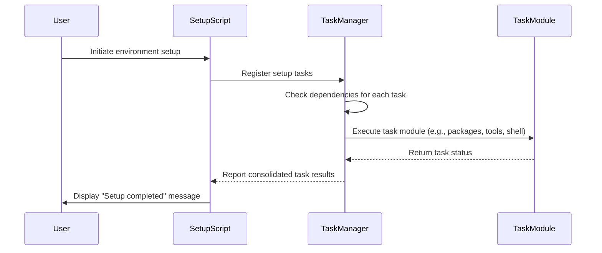

# Martin Mena's Dotfiles and dev environment

[](https://github.com/mmena1/dotfiles/actions/workflows/main.yml?query=branch%3Amain+event%3Apush+workflow%3A%22Chezmoi+Setup+Validation%22)

Welcome to my personal dotfiles repository, tailored for the 🐟 [Fish shell](https://fishshell.com/). These configurations are designed to streamline my development environment, integrating seamlessly with VSCode, Docker, and various programming languages via [.tool-versions](home/dot_tool-versions) through asdf.

<p align="center">
  
</p>

## Key Features

- **Prompt Customization with [⭐️🚀 Starship](https://starship.rs/):** A sleek, informative command-line interface built in Rust.

- **Effortless Dotfile Management:** Uses [chezmoi](https://www.chezmoi.io/) for a streamlined process to update, install, and configure my environment with a simple one-line command.

- **Intelligent OS Detection:** Automatically installs OS-specific packages, ensuring compatibility and ease of setup.

- **User-Guided Installation Script:** Tailored setup with interactive prompts to select only the tools I need.

- **Enhanced File Listing with [eza](https://github.com/eza-community/eza):** A more colorful and user-friendly `ls` command.

- **Optimized Tmux Configuration:** Benefit from a powerful [Tmux setup by gpakosz](https://github.com/gpakosz/.tmux), enhancing your terminal multiplexer experience.

  

## Getting Started

### Compatibility

> **Note:** This setup is currently optimized for macOS and Debian-based Linux distributions.

### Installation

To install, choose one of the following methods and execute the command in my terminal:

- **Curl:**

  ```sh
  sh -c "$(curl -fsLS get.chezmoi.io)" -- init --apply mmena1
  ```

- **Wget:**

  ```sh
  sh -c "$(wget -qO- get.chezmoi.io)" -- init --apply mmena1
  ```

- **Homebrew:**

  ```sh
  brew install chezmoi
  chezmoi init --apply mmena1
  ```

- **Snap:**

  ```sh
  snap install chezmoi --classic
  chezmoi init --apply mmena1
  ```

## Updating my Setup

Keep my environment fresh and up-to-date with a simple command:

```
chezmoi update
```

This will fetch and apply the latest changes from the repository, ensuring my setup remains optimal.

## Under the Hood

### Custom Fish Scripts

Leveraging the best of oh-my-zsh, I've crafted custom Fish scripts, including git and eza abbreviations, enriching my shell without the need for plugins.

### Chezmoi: The Backbone

At the heart of my dotfile management is Chezmoi, a robust tool offering [templating features](https://www.chezmoi.io/user-guide/templating/) to dynamically adapt scripts across various systems, alongside the capability to preview and verify scripts before execution.

### Modular Task Management

A task-based approach is used for managing the setup and configuration of my development environment. Instead of running a monolithic script, the setup process is broken down into discrete tasks that can be individually registered, managed, and executed.

Key features of the task management system:

- **Task Registration**: Each setup component is registered as a task with a name, description, list of dependencies, and execution function.
- **Dependency Resolution**: Tasks specify their dependencies, ensuring they're executed in the correct order. For example, package installation requires Homebrew to be installed first (only for macOS).
- **Interactive Execution**: Before each task runs, I'm prompted to confirm, letting me customize my setup process.
- **Error Handling**: If a task fails, I can choose to continue with the remaining tasks or abort the setup.
- **Modular Implementation**: Setup components are organized into modules (package management, shell configuration, development tools, etc.) that can be maintained independently.

This approach makes the setup process more maintainable, flexible, and user-friendly. New tasks can be added without modifying existing code, and dependencies are automatically resolved to ensure a smooth setup experience.



## Acknowledgments

A special thanks to:

- [GitHub ❤ ~/](https://dotfiles.github.io/) for a fantastic collection of dotfiles repositories.
- [Adam Eivy's dotfiles](https://github.com/atomantic/dotfiles) for inspiration on automation and design.
- [Sebastián Estrella](https://github.com/sestrella) for introducing me to the world of dotfile management.
- [LFreza](https://github.com/LucasFrezarini) for the invaluable memes and laughter shared during work.

## License

This project is licensed under the ISC License - see [Martin Mena](https://github.com/mmena1) for more details.
